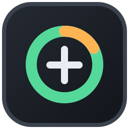

# DSH helper

> Windows 桌面置顶悬浮窗，用于查看 **CCSwitch** 供应商状态、可用余量、最近故障以及 DSH Harness 中的运行时会话。

一个轻量级的 Electron 桌面小程序：把 [CCSwitch](https://github.com/sansan0/CCSwitch) 的供应商数据、`.dsh/storages` 用量统计，以及日志里的报错集中展示在桌面一角，不抢占焦点、可折叠成悬浮球、可隐藏到托盘。



---

## 目录

- [特性](#特性)
- [界面预览](#界面预览)
- [环境要求](#环境要求)
- [快速开始](#快速开始)
- [构建便携版 EXE](#构建便携版-exe)
- [使用说明](#使用说明)
- [数据来源与隐私](#数据来源与隐私)
- [项目结构](#项目结构)
- [配置项](#配置项)
- [常见问题](#常见问题)
- [许可证](#许可证)

---

## 特性

- 🪟 **桌面悬浮窗** — 无边框、透明背景、`screen-saver` 级别置顶，支持任意位置拖动。
- 🧠 **智能解析** — 兼容 `cc-switch.db` 的多种 schema，自动归一化供应商字段。
- 🔐 **隐私优先** — 对所有含 `key/token/secret/password/auth/credential` 的字段做脱敏，永不上传。
- 📦 **多种视图** — 完整模式、折叠模式、悬浮球（Orb）模式，按需切换。
- 🔄 **自动刷新** — 默认每 1 秒拉取一次最新状态，支持手动强制刷新。
- 🛠 **托盘集成** — 关闭即隐藏到系统托盘，右键即可退出。
- 🚀 **便携构建** — 一键生成单文件 EXE，拷贝即用。

## 界面预览

> 暂无截图。可以先在本地 `npm start` 跑起来后，将窗口截图放到 `docs/` 目录并替换此节。

## 环境要求

| 项目 | 版本 |
| --- | --- |
| 操作系统 | Windows 10 / Windows 11 |
| Node.js | ≥ 18（推荐 LTS 20） |
| npm | ≥ 9 |
| Electron | 38（由 `devDependencies` 自动安装） |
| 可选 | [CCSwitch](https://github.com/sansan0/CCSwitch) 的本地数据库 `~/.cc-switch/cc-switch.db` |

## 快速开始

```powershell
# 克隆仓库
git clone https://github.com/<your-name>/dsh-helper.git
cd dsh-helper

# 安装依赖
npm install

# 开发模式启动（开启 --dev，渲染层 console 会输出到主进程）
npm run dev

# 或者普通启动
npm start
```

或者 Windows 用户直接双击仓库根目录的 **`启动悬浮窗.bat`**（等价于 `npm start`）。

## 构建便携版 EXE

```powershell
# 输出 dist/DSH-helper-1.0.7-portable.exe
npm run build

# 仅打包到目录，便于调试
npm run build:dir
```

产物在 `dist/` 下，单文件可直接拷贝给其他 Windows 机器运行。

## 使用说明

| 操作 | 效果 |
| --- | --- |
| 拖动顶部区域 | 移动窗口，位置自动记忆 |
| 双击顶部 / 点击向下箭头 | 切换完整 ↔ 折叠 模式 |
| 点击 ⬤ 按钮 | 折叠为悬浮球（Orb） |
| 点击供应商卡片 | 查看最近错误日志 |
| 点击右上角 ⚙ | 调整置顶、透明度、刷新间隔等设置 |
| 点击 ✕ | 隐藏到系统托盘（应用不退出） |
| 托盘菜单 → 退出 | 彻底关闭应用 |

## 数据来源与隐私

应用在本地以**只读**方式访问以下文件，所有展示字段均经过脱敏处理：

| 路径 | 用途 |
| --- | --- |
| `%USERPROFILE%/.cc-switch/cc-switch.db` | CCSwitch 供应商配置、当前/历史用量 |
| `%USERPROFILE%/.cc-switch/logs/cc-switch.log` | 最近错误日志 |
| `%USERPROFILE%/.cc-switch/settings.json` | 全局偏好 |
| `%USERPROFILE%/.dsh/storages/` | DSH Harness 用量快照 |
| `%USERPROFILE%/.dsh/sessions/` | 运行中的会话记录 |

- 任何含 `key / token / secret / password / auth / credential` 字样的字段一律剔除后再渲染。
- 应用**不会**发起任何外发请求；唯一的网络访问来自 `ccswitch://` 协议唤起 CCSwitch 自身。
- 当数据文件结构无法识别时，界面会显示明确标记的“演示数据”，避免误把空数据当成正常状态。

## 项目结构

```
.
├── assets/                  # 图标与设计资源
│   ├── icon.ico             # Windows 应用图标
│   ├── icon.png             # 占位（生成 .ico 时使用）
│   ├── ccswitch-monitor.svg # README 预览图
│   └── build-icon.js        # 图标生成脚本
├── src/
│   ├── main.js              # Electron 主进程：窗口、托盘、IPC、置顶
│   ├── preload.js           # 预加载脚本，桥接 monitorAPI
│   ├── data-service.js      # 只读解析 CCSwitch / DSH 数据，脱敏与归一化
│   └── renderer/
│       ├── index.html       # 窗口骨架
│       ├── app.js           # 渲染层逻辑（视图切换、刷新、设置面板）
│       └── styles.css       # 玻璃拟态样式
├── package.json             # Electron 与 electron-builder 配置
├── 启动悬浮窗.bat           # Windows 一键启动
├── .gitignore
└── README.md
```

## 配置项

窗口位置、置顶、透明度、折叠状态等会持久化到 `%APPDATA%/DSH helper/monitor-preferences.json`（按 Electron `userData` 路径），可通过应用内 ⚙ 面板调整：

| Key | 默认值 | 说明 |
| --- | --- | --- |
| `alwaysOnTop` | `true` | 始终 `screen-saver` 级别置顶，强制开启 |
| `opacity` | `0.96` | 窗口透明度，取值范围 0.65 – 1.0 |
| `compact` | `false` | 是否以折叠模式启动 |
| `autoRefresh` | `true` | 是否周期性刷新数据 |
| `refreshInterval` | `1` | 刷新间隔（秒），当前固定为 1 |
| `x` / `y` | 自动 | 上次窗口位置，下次启动恢复 |

> 偏好文件由应用自身写入，已加入 `.gitignore`，请勿手动提交。

## 常见问题

<details>
<summary><b>启动后界面显示“演示数据”？</b></summary>

通常是因为 `%USERPROFILE%/.cc-switch/cc-switch.db` 还未生成，或者 schema 与预期差异较大。先确认 CCSwitch 已至少打开过一次，再回到本应用刷新即可。
</details>

<details>
<summary><b>关闭按钮点了没反应？</b></summary>

关闭按钮会隐藏到系统托盘，进程仍在运行。请在托盘菜单选择「退出」彻底关闭。
</details>

<details>
<summary><b>npm install 阶段下载 Electron 失败？</b></summary>

`package.json` 已经配置了 `electronDownload.mirror` 走 npmmirror 镜像。如仍失败，可设置环境变量 `ELECTRON_MIRROR=https://npmmirror.com/mirrors/electron/` 后重试。
</details>

<details>
<summary><b>能跨平台吗？</b></summary>

代码本身是跨平台的，但 `electron-builder` 当前仅配置了 `win/portable`。如需 macOS / Linux 构建，扩展 `build.win` 之外的目标即可。
</details>

## 许可证

[MIT](LICENSE) © DSH

---

如果这个项目对你有帮助，欢迎 ⭐ Star 与 PR！